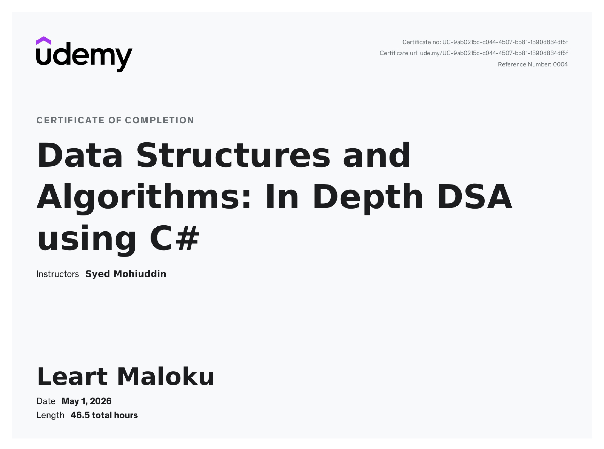
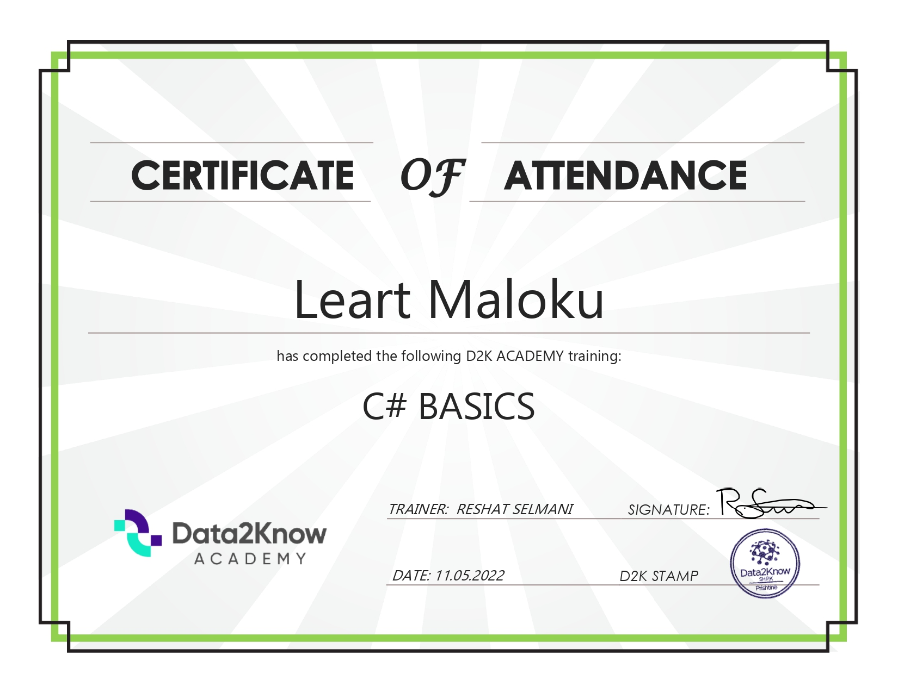
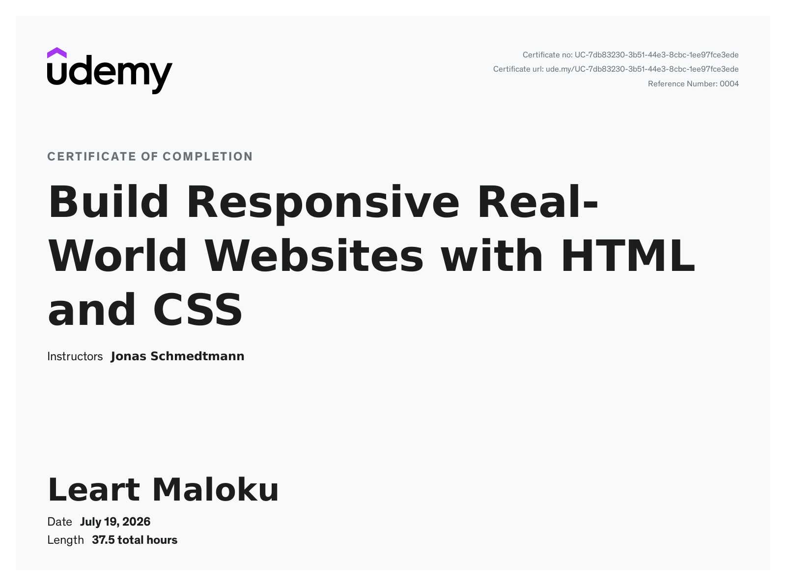
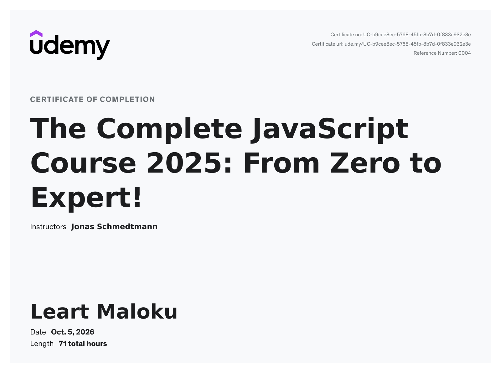

## 📜 Certificates
<h3>C# .NET Programming</h3>

<h3>C# Basics</h3>

<h3>Data Structures & Algorithms</h3>

<h3>C# basics</h3>

<h3>Build Responsive RealWorld Websited with HTML</h3>

<h3>Javascript</h3>

<h3>FullStack Development</h3>

<h3>Reference Letter</h3>

